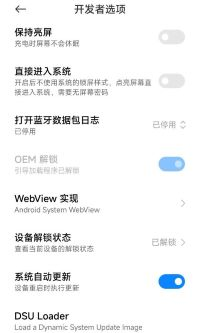
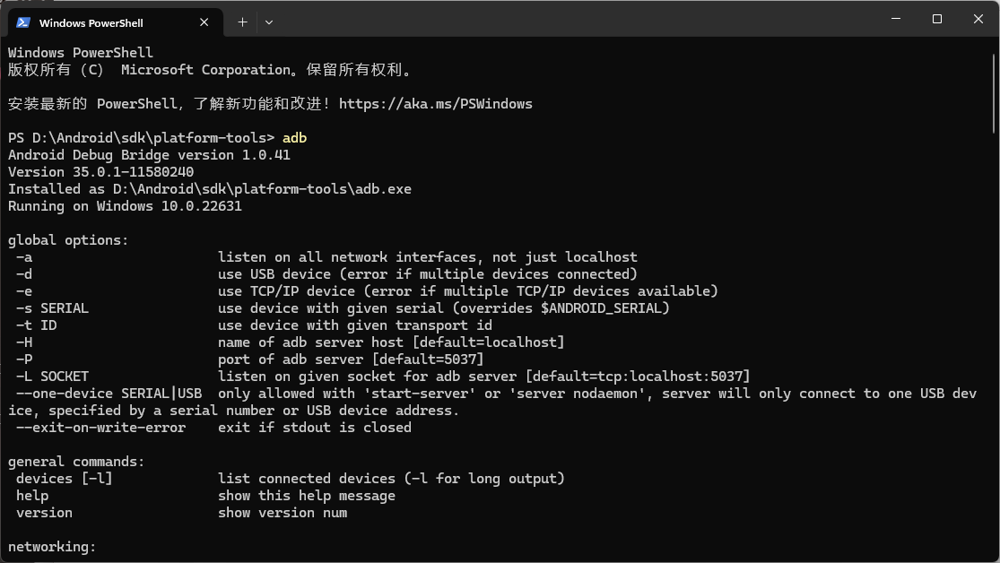

# 准备工作

## 打开USB调试

以我的Redmi K40，MIUI14.0.8为例：1. 打开 `设置` 2. 选择 `我的设备` 3. 点击`全部参数与信息`  4. 连续点击 `MIUI版本` 直至出现弹出开发者模式。然后返回，找到`开发者模式`，在里面选择 `USB调试` 打开就可以了。

## 设备解锁
小米手机需要去下载miflash对手机进行解锁，通常申请时要求168小时候再次尝试。解锁之后，打开开发者选项。
解锁之后的状态是：

   

##  Android SDK的准备（adb，fastboot等）

如果有Android开发经验的同学，用过Android Studio的同学，那么肯定会很熟悉；一般都会放在  `sdk\platform-tools` 下面。
如果没有的话，可以去官网下载：[点此跳转官网](https://developer.android.com/tools/releases/platform-tools?hl=zh-cn)

下载之后保存到一个位置，把 `platform-tools`文件夹的路径添加到环境变量的 `PATH` 中，如我的： `D:\Android\sdk\platform-tools`
添加之后回到  `sdk\platform-tools` 下面，打开命令行
输入 `adb` 出现一大堆东西就证明可以用了。

   

到这我们的adb工具已经准备好了！

## Twrp准备

因为我采用的是卡刷的方式，所以去TWRP官网，找到你手机支持的twrp版本。我这里用的是最新的`3.7.1`
下载并保存到 `\platform-tools` 文件夹下。到此我们Twrp也准备好了！

这里详细的说明和原理建议看B站极客湾的视频，讲解的比较详细 [点击跳转](https://www.bilibili.com/video/BV1BY4y1H7Mc)

然后需要注意的是：如果你的手机是Android11之后的系统，那么系统采用的是VAB分区，而不是传统的Recovery。
这也就是说，在刷Twrp的时候，如果你之前没有刷过Twrp，第一次刷Twrp，这个Twrp只有在本次在刷入时起作用，再次重启就没了。
**即只是临时生效**，这点通过之后需要的adb命令也能看出来：`fastboot boot twrp.img`
如果你像我一样，只是想要刷入Magisk，那么我们可以不需要半固化。如果需要半固化可以参考知乎[ 跳转](https://www.zhihu.com/tardis/bd/art/402787460)

## Magisk准备

1.首先准备一个U盘，可以插手机上，如果只有A口U盘，可以使用拓展坞。
2.到 [此处](https://github.com/topjohnwu/Magisk/releases) 下载 ` .apk` 安装包
下载之后，把此 ` .apk` 安装包的文件名后缀改为 ` .zip` (因为我们之后用twrp刷入magisk包的时候，需要.zip格式的文件)
3.把  ` .zip` 和 ` .apk` 文件分别复制一份到u盘里,至此所有准备工作完成！

**补充一点：** 有些博主选择把Magisk，直接放入手机，这样也可以。但是我在之后的事件中发现，每次在启动Twrp之后，Twrp识别不到手机的储存，必须先进行格式化，才可以正确识别储存，包括手机的内置储存卡。如果格式化之后，手机的文件会被清空。所以我选择在刷入Twrp并且格式化之后，用U盘导入Magsik，再进行刷机获取Root
