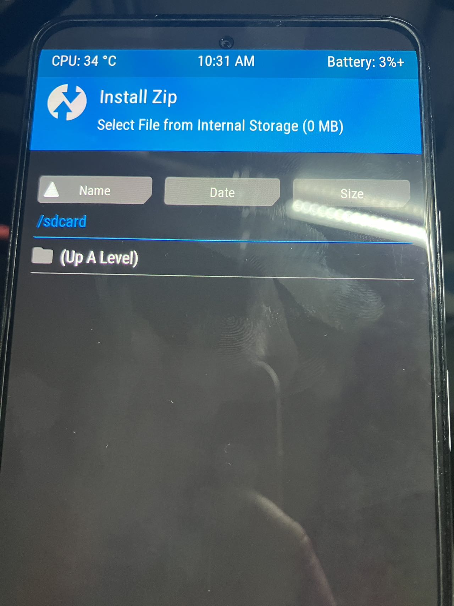
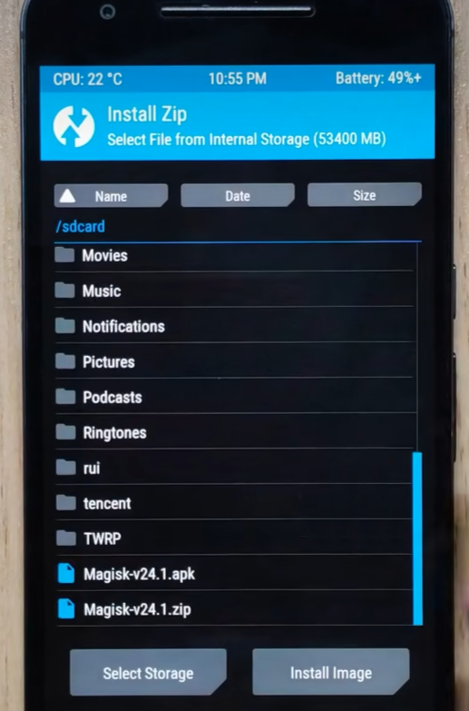

# Root开始

## 进入Fastboot

打开电脑，用数据线连接。在 `sdk\platform-tools`的文件夹下打开命令行。输入 
~~~
adb reboot bootloader
~~~
这个命令可以在手机开机状态下，进入手机的Fastboot模式，方便快捷。当我我们也可以直接通过摁住 `电源键 + 音量下键` （RedmiK40为例，其他品牌百度一下都有）
输入命令之后出现下面图片的就证明成功了

   

这时候和你的手机就会进入Fastboot模式了

然后输入:

~~~
fastboot devices
~~~
如果出现你的设备信息，那就没问题了。如果没有出现，就检查一下USB调试打开了吗或者看看报错是什么问题。

先别关掉这个命令行

## Twrp启动

接下来就是最关键的刷入twrp了捏！
在做准备工作的时候，我们已经把twrp的镜像文件放到了`sdk\platform-tools`文件夹下面了。这里建议把twrp的镜像文件进行重命名，我直接就是命名的`twrp.img`
接着在命令行里输入：

~~~
fastboot boot twrp.img
~~~

效果是这样的：

   

这时候手机的状态是这样的：

   

到这就已经成功一半了！
（设置里可以改成中文）
进入`安装(install)` 如果发现没有识别到手机内存只有0MB，像以下这样：

   

那就到:`Wipe --> Format Data`下面根据提示格式化一下，回来就会发现可以正确识别到手机内存啦

当然，如果你刷入Twrp之后识别到了内存就可以跳过Wipe这步。

到此Twrp就已经临时启动了！
（此时只是用Twrp启动了，并没有把Twrp刷入到手机，关机后重启就消失了）

## 导入Magisk

在准备阶段准备了一个U盘，里面有`Magisk.zip`
这时，我们把U盘插上手机（此时可以拔掉数据线，没有影响）

在Twrp的主界面打开`Advanced --> File Manager -->右下角哟个蓝色的文件夹标志 --> Move`把U盘中的`Magisk.zip`和`Magisk.apk`移动到手机储存里，移动的目标位置就是打开`install`之后所在的目录下。

   
   
  来源:(https://space.bilibili.com/25876945?spm_id_from=333.337.0.0)

解压安装：

   
   
  来源:(https://space.bilibili.com/25876945?spm_id_from=333.337.0.0)

 
开机，把`Magisk.apk`安装了，找不着的话就拿U盘再导一份。
 
至此Magsik安装完成！
